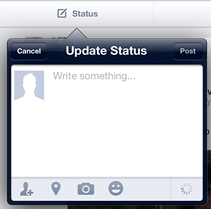

# Architectual Considerations for iOS Development Using MonoTouch

## Introduction

Mobile iOS development using the .NET stack, and in particular C#, is increasingly a stable and economically sound architectural decision. Organisations with an existing investment in Microsoft technologies have the opportunity to leverage tooling and skills to deliver commercially viable cross-platform applications in the mobile space.

iOS development presents several challenges to developers including screen management, application performance, data persistence and life cycle. Additionally while Xamarin provides comprehensive bindings to the underlying Objective C language and the CocoaTouch subsystem there is very little direction or recommendations for the architecture required to make use of the system during rapid development. The [MonoTouch.Dialog]([http://docs.xamarin.com/guides/ios/user_interface/monotouch.dialog) library which is distributed and supported by Xamarin provides a relatively simple interface to rapidly develop user interfaces in code but there are hard limitations to the out of the box features at which point the developer must either extend the existing tooling or fall back to native tools - XCode's interface builder and Xamarin's CocoaTouch bindings. 

This paper will show how to accommodate these requirements while maintaining a clean and extensible architecture.

## Background

I was involved in development on an existing MonoTouch application designed for the iPhone, adding functionality that would be primarily be used on the iPad but with a requirement to continue iPhone support. The application was a line of business app used by field staff to capture and transmit data to the home server. Adding this functionality presented some interesting challenges.

## Development environment

## Device-specific UI junction points

Some user interface functions are only supported on one device idiom. For example, the iPad supports split views (master/detail views) and pop-over controllers, which are not supported on the smaller iPhone's screen. Conversely, the iPhone supports a native numeric keypad while the iPad's equivalent is a full width keyboard with 0-9 alone the top row.

**TODO should actually just use a DeviceIdiomProvider**

Junction points are therefore required to allow the application to determine the appropriate UI mechanism. There are two different categories of device idioms - the device type (iPhone vs iPad) and the pixel density (Retina vs non-Retina). An easy place to access the device idioms is via static properties in the `AppDelegate`. This breaks SRP to a small degree so an alternative is to pass a device configuration provider around via dependency injection. Using the `AppDelegate` is a workable approach for simple cases **bad fix me urg**. The properties look like this:

	public static bool IsPhone {
		get {
			return UIDevice.CurrentDevice.UserInterfaceIdiom == UIUserInterfaceIdiom.Phone;
		}
	}

	public static bool IsPad {
		get {
			return UIDevice.CurrentDevice.UserInterfaceIdiom == UIUserInterfaceIdiom.Pad;
		}
	}

	public static bool IsRetina {
		get {
			if (UIScreen.MainScreen.RespondsToSelector("scale")) {
				return UIScreen.MainScreen.Scale == 2.0;
			} else return false;
		}
	}

The `IsRetina` flag is usually used to pick higher resolution images for Retina displays, which have a pixel density double that of non-Retina displays. The distinction between iPad and iPhone and the need to handle UI differently between the two platforms needs to happen in two places:

- in view controllers to select between different types of UI functionality within a view, and
- when configuring the application event structure in the IoC configuration, to use alternative views

Typically the junction points within a view controller should be as late as possible and the junction point that determine an application's views should be made as early as possible. The bulk of the application logic should avoid junction points and be agnostic of the device that the application is running on.

### Functionality junction points

The iPhone does not support pop-overs, which are views that 'pop over' containing views. An example of a pop-over is the status composition view in Facebook's app:

** TODO this needs to be in example application **

A pop-over that displays an image picker sourced from the camera is implemented like this:

	class MyViewController : ... {
		UIBarButtonItem _cameraBarButtonItem;
		UIImagePickerController _imagePicker;
		UIPopoverController _popoverController;

		MyViewController(..) {
			// ...

			_imagePicker = new UIImagePickerController() {
				Delegate = new MyImagePickerDelegate(),
				SourceType = UIImagePickerControllerSourceType.Camera,
			};

			_popoverController = new UIPopoverController (this) {
				ContentViewController = _imagePicker
			};
			
			_cameraBarButtonItem = new UIBarButtonItem(UIBarButtonSystemItem.Camera, (s,e) => {
				_popoverController.PresentFromBarButtonItem(
					_cameraBarButtonItem, 
					UIPopoverArrawDirection.Any,
					true);
			});

			this.AddRightBarButtons(_cameraBarButtonItem);
		}
	}

As it stands this code will only work on the iPad. On the iPhone the application should navigate to a new page showing the camera controls. To implement this when pressing the same button on the iPhone, we put a junction point in. The app will crash on the iPhone if it even tries to create an instance of a `UIPopoverController`, so the junction has to be implemented like this:

	_imagePicker = ....

	if (AppDelegate.IsPad) {
		_popoverController = new UIPopoverController() {
			ContentViewController = _imagePicker
		};
	}

	_cameraBarButton = new UIBarButtonItem(UIBarButtonSystemItem.Camera, (s,e) => {
		if (AppDelegate.IsPad) {
			_popoverController.PresentFromBarButtonItem(
				_cameraBarButtonItem, 
				UIPopoverArrowDirection.Any,
				true);
		} else {
			_appDelegate.NavigationController.PushViewController(_imagePicker, true);
		}
	});

Note that this structure means that when the application is running on an iPhone the `_popoverController` is always null. This increases the complexity of the code, so a better approach is to combine the camera and popover functionality into one feature:

	public class CameraFeature {
		UIBarButtonItem _button;
		UIImagePickerController _imagePicker;
		UIPopoverController _popoverController;
		AppDelegate _appDelegate;

		public CameraFeature(UIBarButtonItem button, AppDelegate appDelegate) {
			_button = button;
			_appDelegate = appDelegate;

			_imagePicker = new UIImagePickerController {
				// The delegate would be provided by the consuming code
				// ...
			};
			_popoverController = AppDelegate.IsPad ? new UIImagePickerConroller {
				// ...
			} : null;
			_button.Clicked += (s,e) => {
				if (AppDelegate.IsPad) {
					_popoverController.PresentFromBarButtonItem(
						_button, 
						UIPopoverArrowDirection.Any,
						true);
				} else {
					_appDelegate.NavigationController.PushViewController(_imagePicker, true);
				}
			};
		}
	}

	// Usage:
	_cameraBarButtonItem = new UIBarButtonItem(UIBarButtonSystemItem.Camera);
	var cameraFeature = new CameraFeature(_cameraBarButton, _appDelegate);
	this.AddRightBarButtons(_cameraBarButtonItem);

This approach simplifies the consuming code so that is isn't concerned with how the camera feature is surfaced in the application. The junction points are confined to the `CameraFeature` class and the parent view controller just exposes the feature via the button on the navigation bar.

### Application event structure junction points

